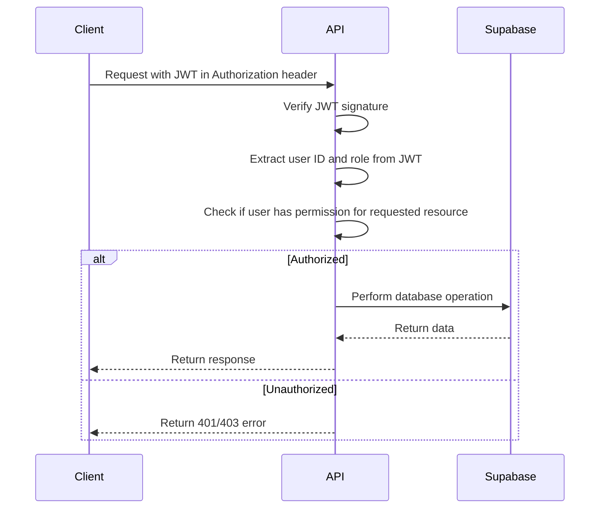

# Backend Architecture Plan for IT Job Search Platform

This document outlines the detailed plan for setting up the backend structure and API for our IT job search platform.

## 1. Backend Project Structure

```
backend/
├── src/
│   ├── config/           # Configuration files
│   │   ├── database.js   # Database configuration
│   │   ├── auth.js       # Authentication configuration
│   │   └── storage.js    # File storage configuration
│   ├── controllers/      # Request handlers
│   │   ├── auth.js       # Authentication controllers
│   │   ├── users.js      # User management controllers
│   │   ├── companies.js  # Company management controllers
│   │   ├── jobs.js       # Job posting controllers
│   │   ├── resumes.js    # Resume controllers
│   │   ├── applications.js # Application controllers
│   │   ├── messages.js   # Messaging controllers
│   │   ├── search.js     # Search controllers
│   │   └── admin.js      # Admin controllers
│   ├── middleware/       # Express middleware
│   │   ├── auth.js       # Authentication middleware
│   │   ├── validation.js # Input validation middleware
│   │   ├── error.js      # Error handling middleware
│   │   └── upload.js     # File upload middleware
│   ├── models/           # Prisma models and database logic
│   │   ├── user.js       # User model operations
│   │   ├── company.js    # Company model operations
│   │   ├── job.js        # Job model operations
│   │   ├── resume.js     # Resume model operations
│   │   ├── application.js # Application model operations
│   │   ├── message.js    # Message model operations
│   │   └── category.js   # Category and tag model operations
│   ├── routes/           # API route definitions
│   │   ├── auth.js       # Authentication routes
│   │   ├── users.js      # User routes
│   │   ├── companies.js  # Company routes
│   │   ├── jobs.js       # Job routes
│   │   ├── resumes.js    # Resume routes
│   │   ├── applications.js # Application routes
│   │   ├── messages.js   # Messaging routes
│   │   ├── search.js     # Search routes
│   │   └── admin.js      # Admin routes
│   ├── services/         # Business logic
│   │   ├── auth.js       # Authentication services
│   │   ├── email.js      # Email notification services
│   │   ├── storage.js    # File storage services
│   │   ├── search.js     # Search services
│   │   └── payment.js    # Payment processing services
│   ├── utils/            # Utility functions
│   │   ├── validation.js # Validation helpers
│   │   ├── formatting.js # Data formatting helpers
│   │   └── security.js   # Security helpers
│   ├── app.js            # Express application setup
│   └── server.js         # Server entry point
├── prisma/               # Prisma ORM files
│   ├── schema.prisma     # Database schema
│   └── migrations/       # Database migrations
├── tests/                # Test files
│   ├── unit/             # Unit tests
│   ├── integration/      # Integration tests
│   └── fixtures/         # Test fixtures
├── .env                  # Environment variables
├── .env.example          # Example environment variables
├── package.json          # Project dependencies
└── README.md             # Project documentation
```

## 2. Database Schema

```prisma
// Prisma schema

generator client {
  provider = "prisma-client-js"
}

datasource db {
  provider = "postgresql"
  url      = env("DATABASE_URL")
}

enum UserRole {
  JOB_SEEKER
  HR
  ADMIN
}

enum JobStatus {
  DRAFT
  PENDING
  ACTIVE
  CLOSED
  REJECTED
}

enum ApplicationStatus {
  PENDING
  REVIEWING
  INTERVIEW
  ACCEPTED
  REJECTED
}

model User {
  id            String    @id @default(uuid())
  email         String    @unique
  passwordHash  String?
  name          String
  role          UserRole
  createdAt     DateTime  @default(now())
  updatedAt     DateTime  @updatedAt
  isActive      Boolean   @default(true)
  
  // Relations
  company       Company?
  resumes       Resume[]
  sentMessages  Message[] @relation("SenderMessages")
  receivedMessages Message[] @relation("ReceiverMessages")
  applications  Application[]
  jobPostings   Job[]
}

model Company {
  id          String    @id @default(uuid())
  name        String
  logoUrl     String?
  description String?
  website     String?
  industry    String?
  size        String?
  location    String?
  createdAt   DateTime  @default(now())
  updatedAt   DateTime  @updatedAt
  isVerified  Boolean   @default(false)
  
  // Relations
  hrId        String    @unique
  hr          User      @relation(fields: [hrId], references: [id])
  jobs        Job[]
}

model Job {
  id              String    @id @default(uuid())
  title           String
  description     String
  salary          Json?     // { min: number, max: number, currency: string }
  employmentType  String
  location        String?
  categoryId      String
  tags            String[]
  status          JobStatus @default(DRAFT)
  createdAt       DateTime  @default(now())
  updatedAt       DateTime  @updatedAt
  
  // Relations
  companyId       String
  company         Company   @relation(fields: [companyId], references: [id])
  hrId            String
  hr              User      @relation(fields: [hrId], references: [id])
  category        Category  @relation(fields: [categoryId], references: [id])
  applications    Application[]
}

model Resume {
  id              String    @id @default(uuid())
  name            String
  contacts        Json      // { email: string, phone: string, linkedin?: string, github?: string }
  experience      Json[]    // [{ position: string, company: string, startDate: date, endDate?: date, description: string }]
  education       Json[]    // [{ institution: string, degree: string, startDate: date, endDate?: date }]
  skills          String[]
  portfolioUrls   String[]
  fileUrl         String?
  desiredSalary   Json?     // { amount: number, currency: string }
  createdAt       DateTime  @default(now())
  updatedAt       DateTime  @updatedAt
  
  // Relations
  userId          String
  user            User      @relation(fields: [userId], references: [id])
  applications    Application[]
}

model Application {
  id              String    @id @default(uuid())
  status          ApplicationStatus @default(PENDING)
  coverLetter     String?
  createdAt       DateTime  @default(now())
  updatedAt       DateTime  @updatedAt
  
  // Relations
  jobId           String
  job             Job       @relation(fields: [jobId], references: [id])
  resumeId        String
  resume          Resume    @relation(fields: [resumeId], references: [id])
  userId          String
  user            User      @relation(fields: [userId], references: [id])
}

model Message {
  id              String    @id @default(uuid())
  content         String
  isRead          Boolean   @default(false)
  createdAt       DateTime  @default(now())
  
  // Relations
  senderId        String
  sender          User      @relation("SenderMessages", fields: [senderId], references: [id])
  receiverId      String
  receiver        User      @relation("ReceiverMessages", fields: [receiverId], references: [id])
}

model Category {
  id              String    @id @default(uuid())
  name            String    @unique
  createdAt       DateTime  @default(now())
  updatedAt       DateTime  @updatedAt
  
  // Relations
  jobs            Job[]
}

model Tag {
  id              String    @id @default(uuid())
  name            String    @unique
  createdAt       DateTime  @default(now())
  updatedAt       DateTime  @updatedAt
}

model Notification {
  id              String    @id @default(uuid())
  type            String
  content         String
  isRead          Boolean   @default(false)
  createdAt       DateTime  @default(now())
  
  // Relations
  userId          String
}

model Payment {
  id              String    @id @default(uuid())
  amount          Float
  currency        String
  status          String
  paymentMethod   String
  createdAt       DateTime  @default(now())
  
  // Relations
  userId          String
  jobId           String?
}
```

## 3. API Endpoints

### Authentication

```
POST /api/auth/register          # Register a new user
POST /api/auth/login             # Login user
POST /api/auth/logout            # Logout user
POST /api/auth/refresh-token     # Refresh JWT token
POST /api/auth/forgot-password   # Request password reset
POST /api/auth/reset-password    # Reset password
GET  /api/auth/me                # Get current user info
```

### Users

```
GET    /api/users                # Get users (admin only)
GET    /api/users/:id            # Get user by ID
PUT    /api/users/:id            # Update user
DELETE /api/users/:id            # Delete user (admin only)
GET    /api/users/:id/profile    # Get user profile
PUT    /api/users/:id/profile    # Update user profile
```

### Companies

```
GET    /api/companies            # Get companies
POST   /api/companies            # Create company (HR only)
GET    /api/companies/:id        # Get company by ID
PUT    /api/companies/:id        # Update company (owner or admin)
DELETE /api/companies/:id        # Delete company (admin only)
PUT    /api/companies/:id/verify # Verify company (admin only)
GET    /api/companies/:id/jobs   # Get company jobs
```

### Jobs

```
GET    /api/jobs                 # Get jobs with filters
POST   /api/jobs                 # Create job (HR only)
GET    /api/jobs/:id             # Get job by ID
PUT    /api/jobs/:id             # Update job (owner or admin)
DELETE /api/jobs/:id             # Delete job (owner or admin)
PUT    /api/jobs/:id/status      # Update job status (owner or admin)
GET    /api/jobs/:id/applications # Get job applications (owner or admin)
```

### Resumes

```
GET    /api/resumes              # Get resumes (HR or admin)
POST   /api/resumes              # Create resume (job seeker only)
GET    /api/resumes/:id          # Get resume by ID
PUT    /api/resumes/:id          # Update resume (owner or admin)
DELETE /api/resumes/:id          # Delete resume (owner or admin)
POST   /api/resumes/:id/file     # Upload resume file
GET    /api/resumes/user/:userId # Get user resumes
```

### Applications

```
GET    /api/applications                # Get applications (admin only)
POST   /api/applications                # Create application (job seeker only)
GET    /api/applications/:id            # Get application by ID
PUT    /api/applications/:id/status     # Update application status (HR or admin)
GET    /api/applications/user/:userId   # Get user applications
```

### Messages

```
GET    /api/messages                    # Get user messages
POST   /api/messages                    # Send message
GET    /api/messages/:id                # Get message by ID
PUT    /api/messages/:id/read           # Mark message as read
GET    /api/messages/conversation/:userId # Get conversation with user
```

### Search

```
GET    /api/search/jobs                 # Search jobs
GET    /api/search/resumes              # Search resumes (HR or admin)
GET    /api/search/companies            # Search companies
```

### Categories and Tags

```
GET    /api/categories                  # Get categories
POST   /api/categories                  # Create category (admin only)
PUT    /api/categories/:id              # Update category (admin only)
DELETE /api/categories/:id              # Delete category (admin only)

GET    /api/tags                        # Get tags
POST   /api/tags                        # Create tag
PUT    /api/tags/:id                    # Update tag (admin only)
DELETE /api/tags/:id                    # Delete tag (admin only)
```

### Admin

```
GET    /api/admin/stats                 # Get platform statistics
GET    /api/admin/users                 # Get all users
PUT    /api/admin/users/:id/role        # Update user role
PUT    /api/admin/users/:id/status      # Update user status
GET    /api/admin/jobs/pending          # Get pending jobs
PUT    /api/admin/jobs/:id/moderate     # Moderate job
GET    /api/admin/companies/pending     # Get pending companies
PUT    /api/admin/companies/:id/moderate # Moderate company
```

### Payments

```
POST   /api/payments/job                # Pay for job posting
POST   /api/payments/subscription       # Pay for subscription
GET    /api/payments/history            # Get payment history
```

## 4. Authentication and Authorization

We'll use JWT (JSON Web Tokens) for authentication, with Supabase Auth as the provider:



### Middleware Implementation

```javascript
// Authentication middleware
const authMiddleware = async (req, res, next) => {
  try {
    const token = req.headers.authorization?.split(' ')[1];
    if (!token) {
      return res.status(401).json({ message: 'Authentication required' });
    }
    
    const decoded = jwt.verify(token, process.env.JWT_SECRET);
    req.user = {
      id: decoded.sub,
      email: decoded.email,
      role: decoded.role
    };
    
    next();
  } catch (error) {
    return res.status(401).json({ message: 'Invalid or expired token' });
  }
};

// Role-based authorization middleware
const authorize = (roles = []) => {
  return (req, res, next) => {
    if (!req.user) {
      return res.status(401).json({ message: 'Authentication required' });
    }
    
    if (roles.length && !roles.includes(req.user.role)) {
      return res.status(403).json({ message: 'Insufficient permissions' });
    }
    
    next();
  };
};
```

## 5. File Storage

We'll use Supabase Storage for file uploads (resumes, company logos, etc.):

```javascript
// File upload service
const uploadFile = async (file, bucket, path) => {
  try {
    const { data, error } = await supabase.storage
      .from(bucket)
      .upload(path, file, {
        cacheControl: '3600',
        upsert: false
      });
      
    if (error) throw error;
    
    // Get public URL
    const { publicURL } = supabase.storage
      .from(bucket)
      .getPublicUrl(path);
      
    return publicURL;
  } catch (error) {
    throw new Error(`Error uploading file: ${error.message}`);
  }
};
```

## 6. Search Implementation

We'll implement search functionality using PostgreSQL's full-text search capabilities:

```javascript
// Job search service
const searchJobs = async (params) => {
  const {
    keywords,
    category,
    tags,
    salaryMin,
    salaryMax,
    employmentType,
    location,
    page = 1,
    limit = 10
  } = params;
  
  let query = prisma.job.findMany({
    where: {
      status: 'ACTIVE',
      ...(keywords && {
        OR: [
          { title: { contains: keywords, mode: 'insensitive' } },
          { description: { contains: keywords, mode: 'insensitive' } }
        ]
      }),
      ...(category && { categoryId: category }),
      ...(tags && tags.length > 0 && { tags: { hasSome: tags } }),
      ...(employmentType && { employmentType }),
      ...(location && { location: { contains: location, mode: 'insensitive' } }),
      ...(salaryMin && { 
        salary: { 
          path: ['min'],
          gte: parseInt(salaryMin)
        } 
      }),
      ...(salaryMax && { 
        salary: { 
          path: ['max'],
          lte: parseInt(salaryMax)
        } 
      })
    },
    include: {
      company: {
        select: {
          id: true,
          name: true,
          logoUrl: true
        }
      },
      category: true
    },
    orderBy: {
      createdAt: 'desc'
    },
    skip: (page - 1) * limit,
    take: limit
  });
  
  const countQuery = prisma.job.count({
    where: query.where
  });
  
  const [jobs, total] = await prisma.$transaction([query, countQuery]);
  
  return {
    jobs,
    pagination: {
      page,
      limit,
      total,
      pages: Math.ceil(total / limit)
    }
  };
};
```

## 7. Notification System

We'll implement a notification system for various events:

```javascript
// Notification types
const NotificationType = {
  NEW_APPLICATION: 'NEW_APPLICATION',
  APPLICATION_STATUS_CHANGE: 'APPLICATION_STATUS_CHANGE',
  NEW_MESSAGE: 'NEW_MESSAGE',
  NEW_JOB_MATCH: 'NEW_JOB_MATCH'
};

// Create notification
const createNotification = async (userId, type, content) => {
  return prisma.notification.create({
    data: {
      userId,
      type,
      content,
      isRead: false
    }
  });
};

// Send email notification
const sendEmailNotification = async (user, subject, content) => {
  // Implementation depends on email service (e.g., Nodemailer, SendGrid)
  // ...
};
```

## 8. Payment Integration

We'll integrate with a payment provider (e.g., Stripe) for job posting fees and subscriptions:

```javascript
// Process job posting payment
const processJobPayment = async (userId, jobId, amount) => {
  try {
    // Create payment intent with Stripe
    const paymentIntent = await stripe.paymentIntents.create({
      amount: amount * 100, // Convert to cents
      currency: 'uah',
      metadata: {
        userId,
        jobId,
        type: 'job_posting'
      }
    });
    
    // Create payment record
    await prisma.payment.create({
      data: {
        userId,
        jobId,
        amount,
        currency: 'UAH',
        status: 'pending',
        paymentMethod: 'card',
        stripePaymentIntentId: paymentIntent.id
      }
    });
    
    return {
      clientSecret: paymentIntent.client_secret
    };
  } catch (error) {
    throw new Error(`Payment processing error: ${error.message}`);
  }
};
```

## 9. Error Handling

We'll implement a centralized error handling middleware:

```javascript
// Error handling middleware
const errorHandler = (err, req, res, next) => {
  // Log error
  console.error(err);
  
  // Prisma error handling
  if (err.name === 'PrismaClientKnownRequestError') {
    if (err.code === 'P2002') {
      return res.status(409).json({
        message: 'A resource with this unique constraint already exists'
      });
    }
    if (err.code === 'P2025') {
      return res.status(404).json({
        message: 'Record not found'
      });
    }
  }
  
  // JWT error handling
  if (err.name === 'JsonWebTokenError') {
    return res.status(401).json({
      message: 'Invalid token'
    });
  }
  
  if (err.name === 'TokenExpiredError') {
    return res.status(401).json({
      message: 'Token expired'
    });
  }
  
  // Validation error handling
  if (err.name === 'ValidationError') {
    return res.status(400).json({
      message: 'Validation error',
      errors: err.errors
    });
  }
  
  // Default error response
  const statusCode = err.statusCode || 500;
  const message = err.message || 'Internal server error';
  
  return res.status(statusCode).json({
    message,
    ...(process.env.NODE_ENV === 'development' && { stack: err.stack })
  });
};
```

## 10. Input Validation

We'll use a validation library (e.g., Joi, Yup) for input validation:

```javascript
// Job validation schema
const jobSchema = Joi.object({
  title: Joi.string().required().max(100),
  description: Joi.string().required().max(5000),
  salary: Joi.object({
    min: Joi.number().min(0),
    max: Joi.number().greater(Joi.ref('min')),
    currency: Joi.string().valid('UAH', 'USD')
  }),
  employmentType: Joi.string().required().valid('FULL_TIME', 'PART_TIME', 'CONTRACT', 'REMOTE', 'HYBRID'),
  location: Joi.string().when('employmentType', {
    is: Joi.valid('REMOTE'),
    then: Joi.optional(),
    otherwise: Joi.required()
  }),
  categoryId: Joi.string().required(),
  tags: Joi.array().items(Joi.string())
});

// Validation middleware
const validate = (schema) => {
  return (req, res, next) => {
    const { error } = schema.validate(req.body, { abortEarly: false });
    
    if (error) {
      const errors = error.details.map(detail => ({
        field: detail.path.join('.'),
        message: detail.message
      }));
      
      return res.status(400).json({
        message: 'Validation error',
        errors
      });
    }
    
    next();
  };
};
```

## 11. Rate Limiting

We'll implement rate limiting to prevent abuse:

```javascript
// Rate limiting middleware
const rateLimiter = rateLimit({
  windowMs: 15 * 60 * 1000, // 15 minutes
  max: 100, // limit each IP to 100 requests per windowMs
  standardHeaders: true,
  legacyHeaders: false,
  message: {
    message: 'Too many requests, please try again later'
  }
});

// Apply rate limiting to authentication routes
app.use('/api/auth', authRateLimiter);
```

## 12. Logging

We'll implement logging for monitoring and debugging:

```javascript
// Logger configuration
const logger = winston.createLogger({
  level: process.env.LOG_LEVEL || 'info',
  format: winston.format.combine(
    winston.format.timestamp(),
    winston.format.json()
  ),
  transports: [
    new winston.transports.Console(),
    new winston.transports.File({ filename: 'error.log', level: 'error' }),
    new winston.transports.File({ filename: 'combined.log' })
  ]
});

// Request logging middleware
const requestLogger = (req, res, next) => {
  const start = Date.now();
  
  res.on('finish', () => {
    const duration = Date.now() - start;
    
    logger.info({
      method: req.method,
      url: req.originalUrl,
      status: res.statusCode,
      duration: `${duration}ms`,
      ip: req.ip,
      userId: req.user?.id
    });
  });
  
  next();
};
```

## 13. Security Measures

We'll implement various security measures:

```javascript
// Security middleware
app.use(helmet()); // Set security headers
app.use(cors({
  origin: process.env.CORS_ORIGIN,
  methods: ['GET', 'POST', 'PUT', 'DELETE'],
  allowedHeaders: ['Content-Type', 'Authorization'],
  credentials: true
}));
app.use(express.json({ limit: '1mb' })); // Limit request body size
app.use(xss()); // Prevent XSS attacks
```

## 14. Implementation Phases

### Phase 1: Project Setup
- Initialize Express project
- Configure middleware
- Set up Prisma with Supabase
- Implement error handling

### Phase 2: Authentication and User Management
- Implement Supabase Auth integration
- Create user management endpoints
- Set up role-based authorization

### Phase 3: Core Entities
- Implement company endpoints
- Create job posting endpoints
- Develop resume endpoints
- Build application tracking

### Phase 4: Search and Filtering
- Implement job search
- Create resume search
- Develop filtering and sorting

### Phase 5: Messaging and Notifications
- Build messaging system
- Implement notification system
- Set up email notifications

### Phase 6: Admin Functionality
- Create admin dashboard endpoints
- Implement moderation workflows
- Develop statistics endpoints

### Phase 7: Payment Integration
- Integrate payment provider
- Implement subscription management
- Create payment history tracking

## 15. Testing Strategy

We'll implement a comprehensive testing strategy:

### Unit Tests
- Test individual functions and methods
- Mock external dependencies
- Focus on business logic

### Integration Tests
- Test API endpoints
- Test database interactions
- Verify authentication and authorization

### End-to-End Tests
- Test complete workflows
- Simulate user interactions
- Verify system behavior

## Next Steps

1. Initialize the Express.js project with the proposed structure
2. Set up Prisma with Supabase
3. Implement authentication with Supabase Auth
4. Create core entity models and controllers
5. Develop API endpoints for basic functionality
6. Implement search and filtering capabilities
7. Build admin functionality