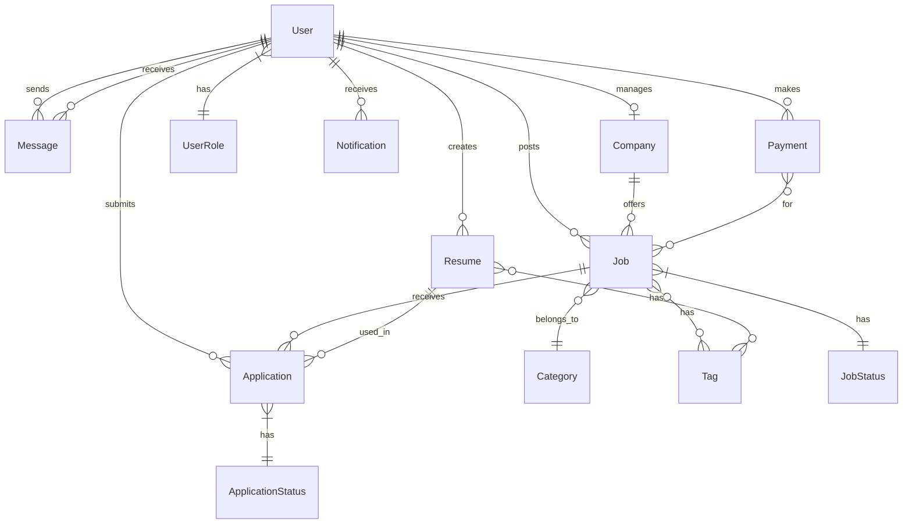

# Database Schema Plan for IT Job Search Platform

This document outlines the database schema design for our IT job search platform, including entity relationships, table structures, and data types.

## Entity Relationship Diagram



## Table Structures

### Users Table

Stores user account information for all platform users.

| Column | Type | Description |
|--------|------|-------------|
| id | UUID | Primary key |
| email | String | Unique email address |
| password_hash | String | Hashed password (null if using OAuth) |
| name | String | User's full name |
| role | Enum | JOB_SEEKER, HR, ADMIN |
| created_at | Timestamp | Account creation time |
| updated_at | Timestamp | Last update time |
| is_active | Boolean | Account status |
| avatar_url | String | Profile picture URL (optional) |
| phone | String | Contact phone (optional) |
| last_login | Timestamp | Last login time |

### Companies Table

Stores company profiles created by HR users.

| Column | Type | Description |
|--------|------|-------------|
| id | UUID | Primary key |
| name | String | Company name |
| logo_url | String | Company logo URL (optional) |
| description | Text | Company description (optional) |
| website | String | Company website URL (optional) |
| industry | String | Industry category |
| size | String | Company size range (e.g., "1-10", "11-50") |
| location | String | Company location (optional) |
| created_at | Timestamp | Creation time |
| updated_at | Timestamp | Last update time |
| is_verified | Boolean | Verification status |
| hr_id | UUID | Foreign key to User table |

### Jobs Table

Stores job postings created by HR users.

| Column | Type | Description |
|--------|------|-------------|
| id | UUID | Primary key |
| title | String | Job title |
| description | Text | Job description |
| salary | JSON | Salary range and currency |
| employment_type | String | Employment type (full-time, part-time, etc.) |
| location | String | Job location (optional for remote) |
| category_id | UUID | Foreign key to Categories table |
| tags | String[] | Array of skill tags |
| status | Enum | DRAFT, PENDING, ACTIVE, CLOSED, REJECTED |
| created_at | Timestamp | Creation time |
| updated_at | Timestamp | Last update time |
| expires_at | Timestamp | Expiration time (optional) |
| company_id | UUID | Foreign key to Companies table |
| hr_id | UUID | Foreign key to User table |
| views_count | Integer | Number of views |
| applications_count | Integer | Number of applications |

### Resumes Table

Stores resumes created by job seekers.

| Column | Type | Description |
|--------|------|-------------|
| id | UUID | Primary key |
| name | String | Resume title/name |
| contacts | JSON | Contact information |
| experience | JSON[] | Work experience array |
| education | JSON[] | Education history array |
| skills | String[] | Array of skill tags |
| portfolio_urls | String[] | Array of portfolio URLs |
| file_url | String | Uploaded resume file URL (optional) |
| desired_salary | JSON | Desired salary and currency (optional) |
| created_at | Timestamp | Creation time |
| updated_at | Timestamp | Last update time |
| user_id | UUID | Foreign key to User table |
| is_public | Boolean | Visibility to HR users |

### Applications Table

Stores job applications submitted by job seekers.

| Column | Type | Description |
|--------|------|-------------|
| id | UUID | Primary key |
| status | Enum | PENDING, REVIEWING, INTERVIEW, ACCEPTED, REJECTED |
| cover_letter | Text | Cover letter (optional) |
| created_at | Timestamp | Submission time |
| updated_at | Timestamp | Last update time |
| job_id | UUID | Foreign key to Jobs table |
| resume_id | UUID | Foreign key to Resumes table |
| user_id | UUID | Foreign key to User table |
| notes | Text | HR notes (private) |

### Messages Table

Stores chat messages between users.

| Column | Type | Description |
|--------|------|-------------|
| id | UUID | Primary key |
| content | Text | Message content |
| is_read | Boolean | Read status |
| created_at | Timestamp | Sent time |
| sender_id | UUID | Foreign key to User table |
| receiver_id | UUID | Foreign key to User table |
| attachment_url | String | Attachment URL (optional) |

### Categories Table

Stores job categories.

| Column | Type | Description |
|--------|------|-------------|
| id | UUID | Primary key |
| name | String | Category name (unique) |
| created_at | Timestamp | Creation time |
| updated_at | Timestamp | Last update time |
| parent_id | UUID | Parent category ID (optional) |

### Tags Table

Stores skill tags used in jobs and resumes.

| Column | Type | Description |
|--------|------|-------------|
| id | UUID | Primary key |
| name | String | Tag name (unique) |
| created_at | Timestamp | Creation time |
| updated_at | Timestamp | Last update time |
| usage_count | Integer | Number of times used |

### Notifications Table

Stores user notifications.

| Column | Type | Description |
|--------|------|-------------|
| id | UUID | Primary key |
| type | String | Notification type |
| content | Text | Notification content |
| is_read | Boolean | Read status |
| created_at | Timestamp | Creation time |
| user_id | UUID | Foreign key to User table |
| related_entity_id | UUID | Related entity ID (optional) |
| related_entity_type | String | Related entity type (optional) |

### Payments Table

Stores payment records.

| Column | Type | Description |
|--------|------|-------------|
| id | UUID | Primary key |
| amount | Decimal | Payment amount |
| currency | String | Currency code |
| status | String | Payment status |
| payment_method | String | Payment method |
| created_at | Timestamp | Payment time |
| user_id | UUID | Foreign key to User table |
| job_id | UUID | Foreign key to Jobs table (optional) |
| subscription_id | UUID | Foreign key to Subscriptions table (optional) |
| external_payment_id | String | Payment provider reference |

### Subscriptions Table

Stores user subscription records.

| Column | Type | Description |
|--------|------|-------------|
| id | UUID | Primary key |
| plan | String | Subscription plan |
| status | String | Subscription status |
| start_date | Timestamp | Start date |
| end_date | Timestamp | End date |
| auto_renew | Boolean | Auto-renewal status |
| user_id | UUID | Foreign key to User table |
| company_id | UUID | Foreign key to Companies table (optional) |

## Indexes

To optimize query performance, we'll create the following indexes:

### Users Table
- Index on `email` (unique)
- Index on `role`

### Companies Table
- Index on `hr_id` (unique)
- Index on `name`
- Index on `industry`
- Index on `location`

### Jobs Table
- Index on `company_id`
- Index on `hr_id`
- Index on `category_id`
- Index on `status`
- Index on `tags`
- Index on `location`
- Index on `employment_type`
- Full-text search index on `title` and `description`

### Resumes Table
- Index on `user_id`
- Index on `skills`
- Index on `is_public`
- Full-text search index on `name` and `experience`

### Applications Table
- Index on `job_id`
- Index on `resume_id`
- Index on `user_id`
- Index on `status`

### Messages Table
- Composite index on `sender_id` and `receiver_id`
- Index on `receiver_id` and `is_read`

### Notifications Table
- Index on `user_id`
- Index on `is_read`

## Data Relationships

### One-to-One Relationships
- User (HR) to Company: Each HR user can manage only one company

### One-to-Many Relationships
- User to Resumes: A user can have multiple resumes
- User to Jobs: An HR user can post multiple jobs
- Company to Jobs: A company can have multiple job postings
- User to Applications: A user can submit multiple applications
- Job to Applications: A job can receive multiple applications
- Resume to Applications: A resume can be used in multiple applications
- User to Notifications: A user can receive multiple notifications
- User to Payments: A user can make multiple payments

### Many-to-Many Relationships
- Jobs to Tags: A job can have multiple tags, and a tag can be associated with multiple jobs
- Resumes to Tags: A resume can have multiple skills, and a skill can be associated with multiple resumes

## Data Validation Rules

### Users
- Email must be unique and valid format
- Password must meet minimum security requirements
- Role must be one of the defined enum values

### Companies
- Name is required
- Logo must be a valid image file (if provided)
- Website must be a valid URL (if provided)

### Jobs
- Title is required and maximum 100 characters
- Description is required and maximum 5000 characters
- Salary must have valid min/max values (if provided)
- Employment type must be one of the defined values
- Location is required unless employment type is remote

### Resumes
- Name is required
- At least one contact method is required
- Skills array cannot be empty

### Applications
- Must reference a valid job and resume
- Status must be one of the defined enum values

## Data Migration Strategy

For the initial deployment and future schema changes, we'll use Prisma migrations:

1. Define the initial schema in `prisma/schema.prisma`
2. Generate the initial migration: `npx prisma migrate dev --name init`
3. Apply the migration to the development database
4. For production deployment, use `npx prisma migrate deploy`

For future schema changes:
1. Update the schema in `prisma/schema.prisma`
2. Generate a new migration: `npx prisma migrate dev --name <change_description>`
3. Review the generated migration SQL
4. Apply to development for testing
5. Apply to production using `npx prisma migrate deploy`

## Data Seeding

For development and testing, we'll create seed data:

```javascript
// prisma/seed.js
const { PrismaClient } = require('@prisma/client');
const prisma = new PrismaClient();

async function main() {
  // Create user roles
  const adminUser = await prisma.user.upsert({
    where: { email: 'admin@example.com' },
    update: {},
    create: {
      email: 'admin@example.com',
      passwordHash: 'hashed_password', // In reality, use bcrypt
      name: 'Admin User',
      role: 'ADMIN',
      isActive: true
    }
  });
  
  const hrUser = await prisma.user.upsert({
    where: { email: 'hr@example.com' },
    update: {},
    create: {
      email: 'hr@example.com',
      passwordHash: 'hashed_password',
      name: 'HR User',
      role: 'HR',
      isActive: true,
      company: {
        create: {
          name: 'Example Tech',
          description: 'A technology company',
          industry: 'Software Development',
          size: '11-50',
          location: 'Kyiv, Ukraine'
        }
      }
    }
  });
  
  const jobSeekerUser = await prisma.user.upsert({
    where: { email: 'jobseeker@example.com' },
    update: {},
    create: {
      email: 'jobseeker@example.com',
      passwordHash: 'hashed_password',
      name: 'Job Seeker',
      role: 'JOB_SEEKER',
      isActive: true
    }
  });
  
  // Create categories
  const categories = [
    { name: 'Frontend Development' },
    { name: 'Backend Development' },
    { name: 'Full Stack Development' },
    { name: 'DevOps' },
    { name: 'UI/UX Design' },
    { name: 'Data Science' },
    { name: 'QA/Testing' }
  ];
  
  for (const category of categories) {
    await prisma.category.upsert({
      where: { name: category.name },
      update: {},
      create: category
    });
  }
  
  // Create tags
  const tags = [
    'JavaScript', 'TypeScript', 'React', 'Vue.js', 'Angular',
    'Node.js', 'Express', 'Python', 'Django', 'Flask',
    'Java', 'Spring', 'PHP', 'Laravel', 'Ruby on Rails',
    'AWS', 'Docker', 'Kubernetes', 'CI/CD', 'Git',
    'SQL', 'PostgreSQL', 'MongoDB', 'Redis', 'GraphQL',
    'HTML', 'CSS', 'Sass', 'Figma', 'Adobe XD'
  ];
  
  for (const tag of tags) {
    await prisma.tag.upsert({
      where: { name: tag },
      update: {},
      create: { name: tag }
    });
  }
  
  console.log('Seed data created successfully');
}

main()
  .catch(e => {
    console.error(e);
    process.exit(1);
  })
  .finally(async () => {
    await prisma.$disconnect();
  });
```

## Performance Considerations

To ensure optimal database performance:

1. **Indexing**: Create appropriate indexes for frequently queried fields
2. **Pagination**: Implement pagination for all list endpoints
3. **Caching**: Use Redis for caching frequently accessed data
4. **Query Optimization**: Use Prisma's query optimization features
5. **Connection Pooling**: Configure proper connection pooling
6. **Monitoring**: Set up database performance monitoring

## Security Considerations

To ensure data security:

1. **Row-Level Security**: Implement Supabase RLS policies
2. **Data Encryption**: Encrypt sensitive data
3. **Access Control**: Implement proper access control in API
4. **Audit Logging**: Log all data modifications
5. **Backup Strategy**: Regular database backups
6. **GDPR Compliance**: Implement data deletion and export capabilities

## Next Steps

1. Create the Prisma schema file based on this design
2. Set up the Supabase database
3. Configure Prisma to connect to Supabase
4. Create initial migrations
5. Implement seed data for development
6. Set up database access in the backend API