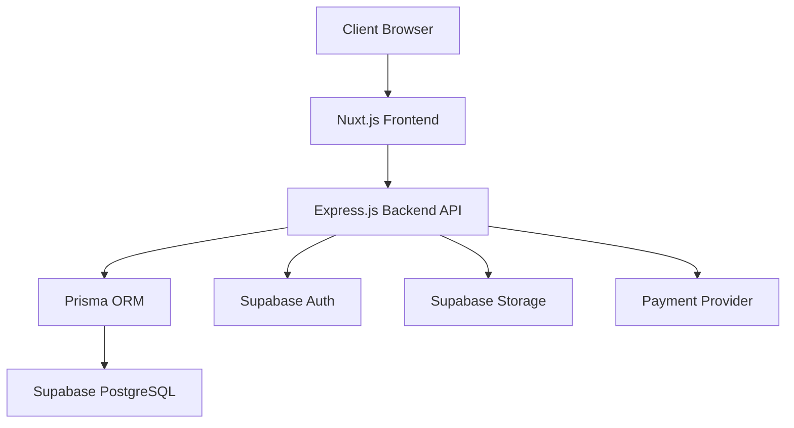

# IT Job Search Platform - Executive Summary

## Project Overview

The IT Job Search Platform is a comprehensive web application designed to connect IT professionals with employers in the Ukrainian market, with plans for international expansion. The platform follows the SLC (Simple, Lovable, Complete) philosophy, providing an intuitive interface and essential features for both job seekers and HR professionals.

## Business Objectives

- Create a competitive alternative to existing platforms like DOU and Djinni.co
- Provide a streamlined experience for IT job search and recruitment
- Facilitate efficient matching between candidates and employers
- Generate revenue through job posting fees and subscription models
- Build a scalable platform that can expand to international markets

## Target Audience

- **Job Seekers**: IT professionals (developers, designers, DevOps, etc.) looking for employment opportunities
- **HR Professionals**: Recruiters and company representatives seeking to hire IT talent
- **Administrators**: Platform moderators ensuring content quality and user compliance

## Key Features

### For Job Seekers
- User profile management with multiple resume support
- Advanced job search with filters (category, skills, salary, location)
- Job application tracking
- Direct messaging with employers
- Personalized job notifications

### For HR Professionals
- Company profile management
- Job posting creation and management
- Candidate search with advanced filters
- Application review and management
- Direct messaging with candidates

### For Administrators
- User management and moderation
- Content moderation (jobs, resumes, companies)
- Platform statistics and reporting
- Category and tag management

## Technology Stack

The platform will be built using modern, scalable technologies:

- **Frontend**: Nuxt.js (Vue.js) with Nuxt UI for components
- **Backend**: Express.js with Prisma ORM
- **Database**: Supabase (PostgreSQL)
- **Authentication**: Supabase Auth
- **File Storage**: Supabase Storage
- **Payments**: Stripe (or alternative)

## Architecture Overview

The platform follows a modern web application architecture:

### Frontend Architecture

The frontend is built with Nuxt.js, providing:
- Server-side rendering for SEO and performance
- Component-based architecture with Nuxt UI
- Responsive design for all devices
- Dark/light theme support
- State management with Pinia

### Backend Architecture

The backend uses Express.js with:
- RESTful API endpoints
- JWT authentication
- Role-based access control
- Prisma ORM for database access
- Middleware for security and validation

### Database Architecture

The database is designed with:
- Normalized schema for data integrity
- Efficient relationships between entities
- Indexes for performance optimization
- Full-text search capabilities
- Row-level security policies

## Implementation Timeline

The project is estimated to take approximately 21 weeks (5 months) to complete, divided into the following phases:

1. **Planning** (2 weeks): Requirements definition, architecture planning
2. **Design** (3 weeks): UI/UX design, wireframing, prototyping
3. **Backend Development** (13 weeks): API development, database integration
4. **Frontend Development** (12 weeks): UI implementation, API integration
5. **Testing** (3 weeks): Unit, integration, and user acceptance testing
6. **Deployment** (1 week): Production deployment and monitoring

## Resource Requirements

- **Development Team**: 7 members (Project Manager, UX/UI Designer, 2 Frontend Developers, 2 Backend Developers, QA Engineer)
- **Infrastructure**: Cloud hosting for frontend, backend, and database
- **Third-party Services**: Authentication, storage, payment processing
- **Development Tools**: Version control, CI/CD, project management

## Revenue Model

The platform will generate revenue through:

1. **Job Posting Fees**: One-time payment for posting a job
2. **Premium Subscriptions**: Monthly/annual subscriptions for HR with enhanced features
3. **Featured Listings**: Additional fee for highlighting job postings
4. **Resume Database Access**: Tiered access to the resume database for HR

## Success Metrics

The success of the platform will be measured by:

- **User Acquisition**: Number of registered job seekers and HR professionals
- **Job Postings**: Number and quality of job postings
- **Applications**: Number of applications submitted
- **Placements**: Number of successful job placements
- **Revenue**: Income from job postings and subscriptions
- **User Satisfaction**: Feedback and ratings from users

## Competitive Advantages

- **User Experience**: Clean, intuitive interface focused on simplicity
- **Performance**: Fast, responsive application with optimized search
- **Security**: GDPR compliance and robust data protection
- **Scalability**: Architecture designed for growth and international expansion
- **Pricing**: Competitive pricing model compared to existing platforms

## Future Expansion

After the initial launch, planned enhancements include:

- **Internationalization**: Support for English and other languages
- **Mobile Applications**: Native mobile apps for iOS and Android
- **AI-Powered Matching**: Advanced algorithms for job and candidate recommendations
- **Interview Scheduling**: Calendar integration for streamlined interview process
- **Community Features**: Forums and networking opportunities
- **Advanced Analytics**: Detailed insights for employers and job seekers

## Risk Assessment

Key risks and mitigation strategies:

| Risk | Mitigation Strategy |
|------|---------------------|
| Market competition | Focus on UX and unique features to differentiate |
| Technical challenges | Early prototyping and technical spikes |
| User adoption | Beta testing with target users, feedback incorporation |
| Scalability issues | Architecture designed for horizontal scaling |
| Security concerns | Security-first development, regular audits |

## Conclusion

The IT Job Search Platform represents a significant opportunity to create a valuable service for the Ukrainian IT market. By focusing on simplicity, user experience, and essential features, the platform aims to provide a compelling alternative to existing solutions while establishing a foundation for future growth and expansion.

The detailed architecture and implementation plans provide a clear roadmap for development, with careful consideration of technical requirements, user needs, and business objectives. With the right execution, this platform has the potential to become a leading resource for IT job search and recruitment in Ukraine and beyond.