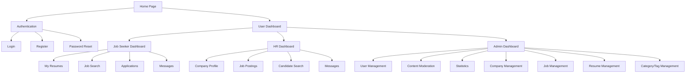
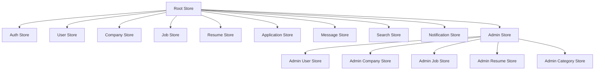
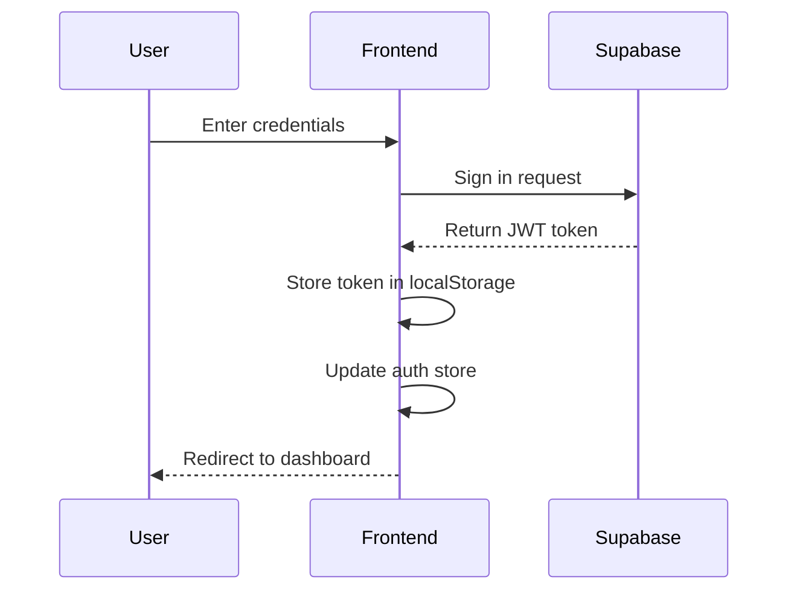
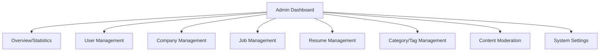
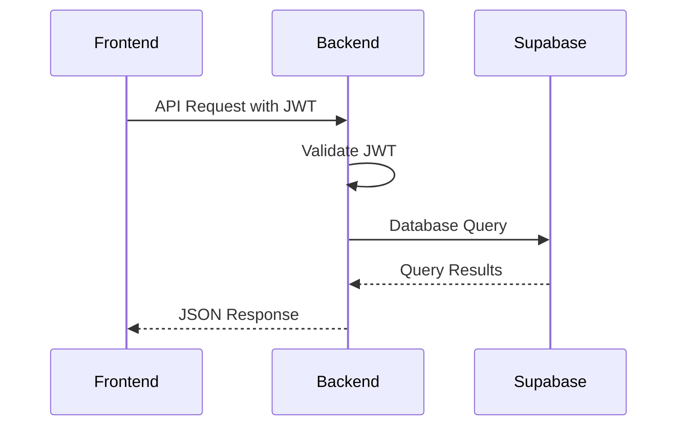

# Frontend Architecture Plan for IT Job Search Platform

This document outlines the detailed plan for setting up the frontend structure and basic pages for our IT job search platform.

## 1. Frontend Project Structure

```
frontend/
├── assets/            # Static assets (images, fonts, etc.)
├── components/        # Reusable Vue components
│   ├── common/        # Common UI components (buttons, inputs, etc.)
│   ├── layout/        # Layout components (header, footer, sidebar)
│   ├── auth/          # Authentication-related components
│   ├── company/       # Company profile components
│   ├── job/           # Job posting components
│   ├── resume/        # Resume components
│   ├── search/        # Search components
│   ├── chat/          # Chat components
│   └── admin/         # Admin dashboard components
├── composables/       # Reusable Vue composables
├── layouts/           # Page layouts
├── middleware/        # Nuxt middleware
├── pages/             # Application pages
├── plugins/           # Vue plugins
├── public/            # Public static files
├── server/            # Server-side code
├── stores/            # Pinia stores for state management
└── utils/             # Utility functions
```

## 2. Key Pages and Routes



### Route Structure

- `/` - Home page
- `/auth` - Authentication routes
  - `/auth/login` - Login page
  - `/auth/register` - Registration page
  - `/auth/reset-password` - Password reset
- `/dashboard` - User dashboard (redirects based on role)
  - `/dashboard/job-seeker` - Job seeker dashboard
  - `/dashboard/hr` - HR dashboard
  - `/dashboard/admin` - Admin dashboard
- `/profile` - User profile
- `/company` - Company routes
  - `/company/create` - Create company
  - `/company/[id]` - View company
  - `/company/[id]/edit` - Edit company
- `/jobs` - Job routes
  - `/jobs/search` - Search jobs
  - `/jobs/[id]` - View job
  - `/jobs/create` - Create job
  - `/jobs/[id]/edit` - Edit job
- `/resumes` - Resume routes
  - `/resumes/create` - Create resume
  - `/resumes/[id]` - View resume
  - `/resumes/[id]/edit` - Edit resume
- `/candidates` - Candidate search (HR only)
- `/applications` - Application management
- `/messages` - Messaging system
- `/admin` - Admin routes
  - `/admin/users` - User management
  - `/admin/companies` - Company management
  - `/admin/jobs` - Job management
  - `/admin/resumes` - Resume management
  - `/admin/categories` - Category management
  - `/admin/tags` - Tag management
  - `/admin/moderation` - Content moderation
  - `/admin/stats` - Statistics

## 3. State Management with Pinia

We'll use Pinia for state management with the following stores:



### Store Structure

- **Auth Store**: Handle authentication state, login, logout, registration
- **User Store**: User profile data and management
- **Company Store**: Company profile data and management
- **Job Store**: Job posting data and management
- **Resume Store**: Resume data and management
- **Application Store**: Job application tracking
- **Message Store**: Chat messaging functionality
- **Search Store**: Search parameters and results
- **Notification Store**: User notifications
- **Admin Store**: Admin-specific functionality
  - **Admin User Store**: User management operations
  - **Admin Company Store**: Company management operations
  - **Admin Job Store**: Job posting management operations
  - **Admin Resume Store**: Resume management operations
  - **Admin Category Store**: Category and tag management operations

## 4. UI Component Library Integration

We'll use Nuxt UI for our component library, with a consistent design system:

### Theme Configuration

```js
// nuxt.config.ts
export default defineNuxtConfig({
  modules: ['@nuxt/ui'],
  ui: {
    global: true,
    icons: ['heroicons', 'simple-icons'],
    safelistColors: ['primary', 'secondary', 'success', 'warning', 'error', 'info'],
    themes: {
      light: {
        colors: {
          primary: '#3B82F6',
          secondary: '#6B7280',
          // Other color definitions
        }
      },
      dark: {
        colors: {
          primary: '#60A5FA',
          secondary: '#9CA3AF',
          // Other color definitions
        }
      }
    }
  }
})
```

### Core Components

- **Buttons**: Primary, secondary, text, icon buttons
- **Forms**: Input fields, select dropdowns, checkboxes, radio buttons
- **Cards**: Job cards, resume cards, company cards
- **Modals**: Confirmation dialogs, forms in modals
- **Navigation**: Navbar, sidebar, breadcrumbs
- **Tables**: Data tables for listings
- **Pagination**: For search results and listings

## 5. Authentication Flow



## 6. API Integration

We'll create composables for API integration with the backend:

```js
// Example API composable for jobs
export const useJobsApi = () => {
  const config = useRuntimeConfig()
  const baseUrl = config.public.apiBaseUrl
  
  const getJobs = async (params) => {
    // Implementation
  }
  
  const getJob = async (id) => {
    // Implementation
  }
  
  const createJob = async (jobData) => {
    // Implementation
  }
  
  const updateJob = async (id, jobData) => {
    // Implementation
  }
  
  const deleteJob = async (id) => {
    // Implementation
  }
  
  return {
    getJobs,
    getJob,
    createJob,
    updateJob,
    deleteJob
  }
}
```

## 7. Responsive Design Strategy

We'll implement a mobile-first approach using Nuxt UI's responsive utilities:

- Use responsive grid layouts
- Implement collapsible navigation for mobile
- Optimize forms for mobile input
- Ensure touch-friendly UI elements
- Test on multiple device sizes

## 8. Implementation Phases

### Phase 1: Project Setup and Core Structure
- Initialize Nuxt.js project
- Configure Nuxt UI
- Set up project structure
- Implement basic layouts
- Configure routing

### Phase 2: Authentication and User Management
- Implement login/registration pages
- Set up Supabase authentication
- Create user profile pages
- Implement role-based access control

### Phase 3: Company and Job Management
- Create company profile pages
- Implement job posting functionality
- Build job search and filtering

### Phase 4: Resume and Application System
- Build resume creation interface
- Implement resume search
- Create application tracking system

### Phase 5: Chat and Notifications
- Implement messaging system
- Build notification system
- Create email notification templates

### Phase 6: Admin Dashboard
- Build admin interface
- Implement moderation tools
- Create statistics and reporting
- Develop comprehensive entity management

### Phase 7: Payment Integration
- Implement payment flows
- Create subscription management
- Build billing history

## 9. Key Components Design

### Job Card Component
```vue
<template>
  <UCard :ui="{ ring: 'hover:ring-2 ring-primary-500', body: { padding: 'p-4' } }">
    <template #header>
      <div class="flex items-center justify-between">
        <h3 class="text-lg font-semibold">{{ job.title }}</h3>
        <UBadge :color="getStatusColor(job.status)">{{ job.status }}</UBadge>
      </div>
    </template>
    
    <div class="space-y-2">
      <div class="flex items-center">
        <UAvatar :src="job.company.logo" size="sm" />
        <span class="ml-2">{{ job.company.name }}</span>
      </div>
      
      <div class="flex flex-wrap gap-2">
        <UBadge v-for="tag in job.tags" :key="tag" color="gray" variant="soft">
          {{ tag }}
        </UBadge>
      </div>
      
      <div class="flex items-center justify-between text-sm text-gray-500">
        <div class="flex items-center">
          <UIcon name="i-heroicons-map-pin" class="mr-1" />
          <span>{{ job.location }}</span>
        </div>
        
        <div class="flex items-center">
          <UIcon name="i-heroicons-currency-dollar" class="mr-1" />
          <span>{{ formatSalary(job.salary) }}</span>
        </div>
        
        <div class="flex items-center">
          <UIcon name="i-heroicons-briefcase" class="mr-1" />
          <span>{{ job.employmentType }}</span>
        </div>
      </div>
    </div>
    
    <template #footer>
      <div class="flex justify-between items-center">
        <span class="text-sm text-gray-500">
          Posted {{ formatDate(job.createdAt) }}
        </span>
        <UButton size="sm" to="`/jobs/${job.id}`">View Details</UButton>
      </div>
    </template>
  </UCard>
</template>
```

### Search Filter Component
```vue
<template>
  <div class="bg-white dark:bg-gray-800 p-4 rounded-lg shadow">
    <h3 class="text-lg font-medium mb-4">Filters</h3>
    
    <div class="space-y-4">
      <!-- Search input -->
      <div>
        <UFormGroup label="Keywords">
          <UInput v-model="filters.keywords" placeholder="Search jobs..." />
        </UFormGroup>
      </div>
      
      <!-- Category select -->
      <div>
        <UFormGroup label="Category">
          <USelect
            v-model="filters.category"
            :options="categories"
            placeholder="Select category"
          />
        </UFormGroup>
      </div>
      
      <!-- Tags/Skills -->
      <div>
        <UFormGroup label="Skills">
          <USelectMenu
            v-model="filters.tags"
            :options="availableTags"
            multiple
            placeholder="Select skills"
          />
        </UFormGroup>
      </div>
      
      <!-- Salary range -->
      <div>
        <UFormGroup label="Salary Range">
          <URangeSlider
            v-model="filters.salaryRange"
            :min="0"
            :max="10000"
            :step="100"
          />
          <div class="flex justify-between text-sm text-gray-500">
            <span>${{ filters.salaryRange[0] }}</span>
            <span>${{ filters.salaryRange[1] }}+</span>
          </div>
        </UFormGroup>
      </div>
      
      <!-- Employment type -->
      <div>
        <UFormGroup label="Employment Type">
          <UCheckbox
            v-for="type in employmentTypes"
            :key="type.value"
            v-model="filters.employmentType"
            :value="type.value"
            :label="type.label"
          />
        </UFormGroup>
      </div>
      
      <!-- Location -->
      <div>
        <UFormGroup label="Location">
          <UInput v-model="filters.location" placeholder="City or Remote" />
        </UFormGroup>
      </div>
      
      <!-- Action buttons -->
      <div class="flex justify-between pt-2">
        <UButton variant="ghost" @click="resetFilters">Reset</UButton>
        <UButton @click="applyFilters">Apply Filters</UButton>
      </div>
    </div>
  </div>
</template>
```

## 10. Admin Dashboard Design

The admin dashboard will be a comprehensive management interface allowing administrators to manage all aspects of the platform.

### Admin Dashboard Structure



### Admin User Management

The user management section will allow administrators to:
- View a list of all users with filtering and sorting
- Edit user profiles and change roles
- Disable/enable user accounts
- Reset user passwords
- View user activity logs

```vue
<!-- Example Admin User Management Component -->
<template>
  <div>
    <div class="flex justify-between items-center mb-6">
      <h1 class="text-2xl font-bold">User Management</h1>
      <UButton icon="i-heroicons-plus" @click="openCreateUserModal">
        Add User
      </UButton>
    </div>
    
    <!-- Filters -->
    <div class="bg-white dark:bg-gray-800 p-4 rounded-lg shadow mb-6">
      <div class="grid grid-cols-1 md:grid-cols-3 gap-4">
        <UFormGroup label="Search">
          <UInput v-model="filters.search" placeholder="Search users..." />
        </UFormGroup>
        
        <UFormGroup label="Role">
          <USelect
            v-model="filters.role"
            :options="[
              { label: 'All Roles', value: '' },
              { label: 'Job Seeker', value: 'job_seeker' },
              { label: 'HR', value: 'hr' },
              { label: 'Admin', value: 'admin' }
            ]"
          />
        </UFormGroup>
        
        <UFormGroup label="Status">
          <USelect
            v-model="filters.status"
            :options="[
              { label: 'All Statuses', value: '' },
              { label: 'Active', value: 'active' },
              { label: 'Disabled', value: 'disabled' }
            ]"
          />
        </UFormGroup>
      </div>
      
      <div class="flex justify-end mt-4">
        <UButton variant="ghost" @click="resetFilters" class="mr-2">Reset</UButton>
        <UButton @click="applyFilters">Apply Filters</UButton>
      </div>
    </div>
    
    <!-- Users Table -->
    <UTable
      :columns="columns"
      :rows="users"
      :loading="loading"
      :sort="sort"
      @sort="sort = $event"
    >
      <template #status-data="{ row }">
        <UBadge :color="row.status === 'active' ? 'success' : 'error'">
          {{ row.status }}
        </UBadge>
      </template>
      
      <template #actions-data="{ row }">
        <div class="flex space-x-2">
          <UButton
            icon="i-heroicons-pencil"
            color="gray"
            variant="ghost"
            @click="editUser(row)"
          />
          <UButton
            :icon="row.status === 'active' ? 'i-heroicons-lock-closed' : 'i-heroicons-lock-open'"
            :color="row.status === 'active' ? 'warning' : 'success'"
            variant="ghost"
            @click="toggleUserStatus(row)"
          />
          <UButton
            icon="i-heroicons-trash"
            color="danger"
            variant="ghost"
            @click="confirmDeleteUser(row)"
          />
        </div>
      </template>
    </UTable>
    
    <!-- Pagination -->
    <div class="mt-4 flex justify-between items-center">
      <div class="text-sm text-gray-500">
        Showing {{ pagination.from }}-{{ pagination.to }} of {{ pagination.total }} users
      </div>
      <UPagination
        v-model="pagination.page"
        :total="pagination.total"
        :per-page="pagination.perPage"
        @update:page="fetchUsers"
      />
    </div>
    
    <!-- User Edit Modal -->
    <UModal v-model="showEditModal">
      <UCard>
        <template #header>
          <div class="flex justify-between items-center">
            <h3 class="text-lg font-medium">{{ isCreating ? 'Create User' : 'Edit User' }}</h3>
            <UButton icon="i-heroicons-x-mark" color="gray" variant="ghost" @click="showEditModal = false" />
          </div>
        </template>
        
        <div class="space-y-4">
          <UFormGroup label="Email" required>
            <UInput v-model="editingUser.email" type="email" />
          </UFormGroup>
          
          <UFormGroup label="Name" required>
            <UInput v-model="editingUser.name" />
          </UFormGroup>
          
          <UFormGroup label="Role" required>
            <USelect
              v-model="editingUser.role"
              :options="[
                { label: 'Job Seeker', value: 'job_seeker' },
                { label: 'HR', value: 'hr' },
                { label: 'Admin', value: 'admin' }
              ]"
            />
          </UFormGroup>
          
          <UFormGroup label="Status">
            <USelect
              v-model="editingUser.status"
              :options="[
                { label: 'Active', value: 'active' },
                { label: 'Disabled', value: 'disabled' }
              ]"
            />
          </UFormGroup>
          
          <UFormGroup v-if="isCreating" label="Password" required>
            <UInput v-model="editingUser.password" type="password" />
          </UFormGroup>
        </div>
        
        <template #footer>
          <div class="flex justify-end space-x-2">
            <UButton variant="ghost" @click="showEditModal = false">Cancel</UButton>
            <UButton @click="saveUser">{{ isCreating ? 'Create' : 'Save' }}</UButton>
          </div>
        </template>
      </UCard>
    </UModal>
    
    <!-- Delete Confirmation Modal -->
    <UModal v-model="showDeleteModal">
      <UCard>
        <template #header>
          <div class="flex justify-between items-center">
            <h3 class="text-lg font-medium">Confirm Deletion</h3>
            <UButton icon="i-heroicons-x-mark" color="gray" variant="ghost" @click="showDeleteModal = false" />
          </div>
        </template>
        
        <p>Are you sure you want to delete the user "{{ userToDelete?.name }}"? This action cannot be undone.</p>
        
        <template #footer>
          <div class="flex justify-end space-x-2">
            <UButton variant="ghost" @click="showDeleteModal = false">Cancel</UButton>
            <UButton color="danger" @click="deleteUser">Delete</UButton>
          </div>
        </template>
      </UCard>
    </UModal>
  </div>
</template>
```

### Admin Company Management

The company management section will allow administrators to:
- View a list of all companies with filtering and sorting
- Edit company profiles
- Verify/unverify companies
- Delete companies
- View company activity

### Admin Job Management

The job management section will allow administrators to:
- View a list of all jobs with filtering and sorting
- Edit job postings
- Approve/reject job postings
- Delete job postings
- View job statistics

### Admin Resume Management

The resume management section will allow administrators to:
- View a list of all resumes with filtering and sorting
- Edit resumes
- Approve/reject resumes
- Delete resumes
- View resume statistics

### Admin Category/Tag Management

The category and tag management section will allow administrators to:
- Create, edit, and delete job categories
- Create, edit, and delete skill tags
- Merge similar tags
- Set category/tag priorities

## 11. Integration with Backend

The frontend will communicate with the backend through RESTful API endpoints:



## 12. Performance Considerations

- Implement lazy loading for components and routes
- Use SSR for initial page load and SEO
- Optimize image loading with responsive images
- Implement pagination for large data sets
- Use caching strategies for API responses
- Minimize JavaScript bundle size with code splitting

## 13. Accessibility Considerations

- Ensure proper semantic HTML structure
- Implement ARIA attributes where needed
- Maintain sufficient color contrast
- Ensure keyboard navigation
- Support screen readers
- Test with accessibility tools

## Next Steps

1. Initialize the Nuxt.js project with the proposed structure
2. Set up Nuxt UI and configure theming
3. Create the basic layouts and navigation components
4. Implement the authentication flow with Supabase
5. Build the core pages for each user role
6. Develop the admin dashboard with comprehensive management capabilities