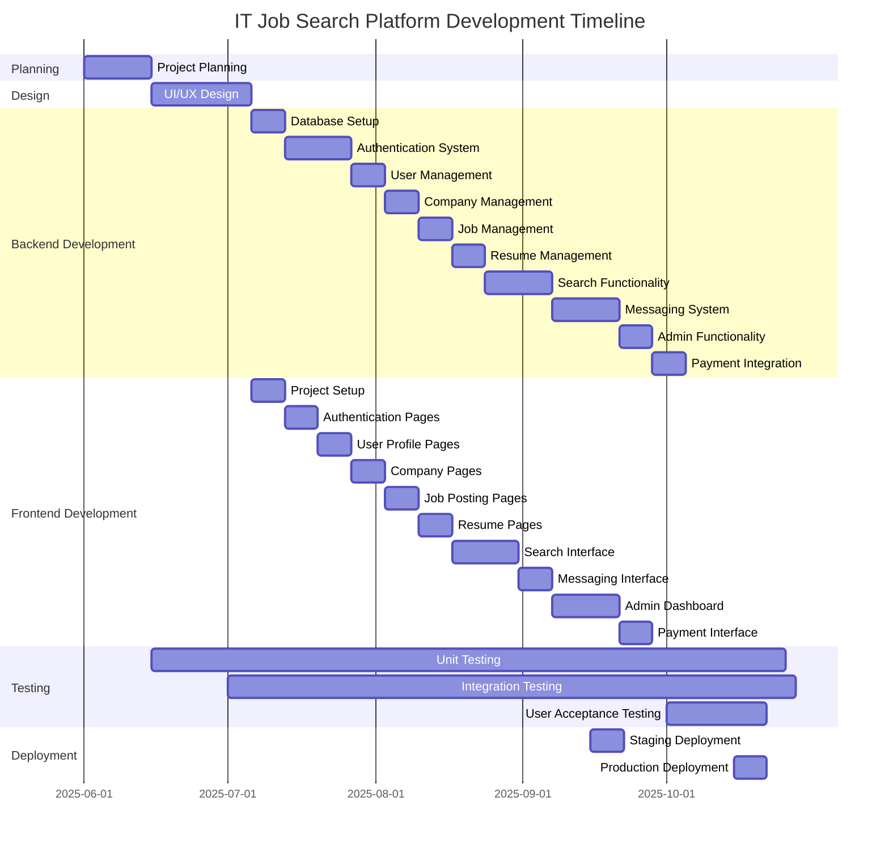

# Project Implementation Plan for IT Job Search Platform

This document outlines the comprehensive implementation plan for developing the IT job search platform, including development phases, timeline, resource allocation, and risk management.

## 1. Project Overview

The IT job search platform is a web application designed for the Ukrainian IT market, connecting job seekers with employers. The platform follows the SLC (Simple, Lovable, Complete) format, providing an intuitive interface and key features for HR professionals and job seekers.

### Key Objectives

- Create a user-friendly platform for IT job search and recruitment
- Implement core features for job posting, resume creation, and application management
- Develop a robust search system with filtering capabilities
- Build a secure authentication and authorization system
- Implement a messaging system for communication between users
- Create an admin dashboard for platform management
- Integrate payment processing for job posting fees

## 2. Development Approach

We will follow an Agile development methodology with two-week sprints. The development will be divided into phases, with each phase focusing on specific features and functionality.

### Development Principles

- **User-Centric Design**: Focus on user experience and intuitive interfaces
- **Iterative Development**: Build incrementally with regular feedback
- **Quality Assurance**: Implement testing at all levels (unit, integration, end-to-end)
- **Security First**: Prioritize security in all aspects of development
- **Performance Optimization**: Ensure fast load times and responsive interfaces
- **Accessibility**: Follow WCAG guidelines for accessibility

### Development Environment

- **Version Control**: Git with GitHub for source code management
- **CI/CD**: GitHub Actions for continuous integration and deployment
- **Development**: Local development environments with Docker
- **Staging**: Staging environment for testing before production
- **Production**: Production environment for the live application

## 3. Project Phases and Timeline

The project is estimated to take approximately 21 weeks (5 months) to complete, divided into the following phases:

### Phase 1: Planning (2 weeks)
- Define detailed requirements and specifications
- Finalize technology stack and architecture
- Set up project management tools and workflows
- Create detailed project plan and timeline

### Phase 2: Design (3 weeks)
- Create wireframes and mockups for all pages
- Design UI components and style guide
- Design responsive layouts for mobile and desktop
- Create user flow diagrams
- Finalize design system with dark/light themes

### Phase 3: Backend Development (13 weeks)
- Set up database schema and Prisma models
- Implement authentication and authorization
- Develop user management functionality
- Create company profile management
- Implement job posting functionality
- Develop resume management
- Build search functionality with filters
- Create messaging system
- Implement notification system
- Develop admin functionality
- Integrate payment processing

### Phase 4: Frontend Development (12 weeks, overlapping with backend)
- Set up Nuxt.js project with Nuxt UI
- Implement authentication pages
- Create user profile pages
- Build company profile pages
- Develop job posting interface
- Implement resume creation system
- Build search interface with filters
- Create messaging interface
- Develop notification components
- Build admin dashboard
- Implement payment interface

### Phase 5: Testing (3 weeks, overlapping with development)
- Write and execute unit tests
- Perform integration testing
- Conduct end-to-end testing
- Perform security testing
- Conduct user acceptance testing
- Fix bugs and issues

### Phase 6: Deployment (1 week)
- Set up production environment
- Deploy application to production
- Perform final testing in production
- Monitor system performance and stability

## 4. Resource Allocation

### Team Structure

- **Project Manager**: Oversees the project, coordinates team, manages timeline
- **UX/UI Designer**: Creates wireframes, mockups, and design system
- **Frontend Developers (2)**: Implement the Nuxt.js frontend
- **Backend Developers (2)**: Develop the Express.js backend and API
- **Database Specialist**: Designs and optimizes the database schema
- **QA Engineer**: Creates and executes test plans, identifies bugs
- **DevOps Engineer**: Sets up CI/CD, manages deployment environments

### Technology Stack

- **Frontend**: Nuxt.js (Vue.js), Nuxt UI
- **Backend**: Express.js, Prisma ORM
- **Database**: Supabase (PostgreSQL)
- **Authentication**: Supabase Auth
- **File Storage**: Supabase Storage
- **Payments**: Stripe (or alternative)
- **Hosting**: Vercel (frontend), Heroku (backend)

## 5. Sprint Planning

The project will be divided into two-week sprints, with the following structure:

### Sprint Structure
- **Sprint Planning**: Define goals and tasks for the sprint
- **Daily Standups**: Brief team meetings to discuss progress and blockers
- **Sprint Review**: Demonstrate completed features to stakeholders
- **Sprint Retrospective**: Reflect on the sprint and identify improvements

### Initial Sprints Outline

#### Sprint 1: Project Setup and Planning
- Set up development environments
- Create project repositories
- Define coding standards and guidelines
- Set up CI/CD pipelines
- Begin UI/UX design

#### Sprint 2: Design and Database Setup
- Complete UI/UX design for core pages
- Set up database schema
- Configure Prisma models
- Implement basic API structure

#### Sprint 3: Authentication and User Management
- Implement Supabase authentication
- Create user registration and login
- Develop user profile management
- Build frontend authentication pages

#### Sprint 4: Company and Job Management
- Implement company profile creation
- Develop job posting functionality
- Create company and job frontend pages
- Build job listing interface

#### Sprint 5: Resume and Application System
- Implement resume creation
- Develop application submission
- Create resume builder interface
- Build application tracking system

#### Sprint 6: Search Functionality
- Implement job search with filters
- Develop resume search for HR
- Create search interface components
- Build advanced filtering system

#### Sprint 7: Messaging and Notifications
- Implement messaging system
- Develop notification system
- Create chat interface
- Build notification components

#### Sprint 8: Admin Functionality
- Implement admin dashboard
- Develop moderation tools
- Create user management interface
- Build statistics and reporting

#### Sprint 9: Payment Integration and Testing
- Integrate payment processing
- Implement subscription management
- Perform comprehensive testing
- Fix bugs and issues

#### Sprint 10: Final Testing and Deployment
- Conduct user acceptance testing
- Fix remaining issues
- Prepare for production deployment
- Deploy to production

## 6. Testing Strategy

### Testing Levels

- **Unit Testing**: Test individual components and functions
- **Integration Testing**: Test interactions between components
- **End-to-End Testing**: Test complete user workflows
- **Performance Testing**: Test system performance under load
- **Security Testing**: Test for vulnerabilities and security issues
- **Accessibility Testing**: Test for accessibility compliance

### Testing Tools

- **Unit Testing**: Jest, Vue Test Utils
- **Integration Testing**: Supertest
- **End-to-End Testing**: Cypress
- **Performance Testing**: Lighthouse, WebPageTest
- **Security Testing**: OWASP ZAP, Snyk
- **Accessibility Testing**: axe, Lighthouse

## 7. Deployment Strategy

### Environments

- **Development**: Local development environments
- **Staging**: Pre-production environment for testing
- **Production**: Live environment for end users

### Deployment Process

1. **Code Review**: All code changes undergo peer review
2. **Automated Testing**: CI/CD pipeline runs automated tests
3. **Staging Deployment**: Changes are deployed to staging environment
4. **Manual Testing**: QA performs manual testing in staging
5. **Production Deployment**: Changes are deployed to production
6. **Monitoring**: System is monitored for issues after deployment

## 8. Risk Management

### Potential Risks and Mitigation Strategies

| Risk | Probability | Impact | Mitigation Strategy |
|------|------------|--------|---------------------|
| Technical challenges with Supabase integration | Medium | High | Early prototyping, technical spikes, consultation with Supabase experts |
| Scope creep | High | Medium | Clear requirements documentation, change control process, regular stakeholder alignment |
| Integration issues between frontend and backend | Medium | Medium | Clear API documentation, early integration testing, regular sync between teams |
| Performance issues with search functionality | Medium | High | Performance testing early in development, optimization strategies, caching |
| Security vulnerabilities | Low | High | Security-first development, regular security audits, penetration testing |
| Timeline delays | Medium | Medium | Buffer time in schedule, regular progress tracking, adjustable scope |
| User adoption challenges | Medium | High | User-centric design, beta testing with target users, feedback incorporation |

## 9. Quality Assurance

### Quality Metrics

- **Code Quality**: Measured by linting, code reviews, and static analysis
- **Test Coverage**: Aim for >80% test coverage for critical components
- **Performance**: Page load times <2 seconds, API response times <500ms
- **Accessibility**: WCAG 2.1 AA compliance
- **Security**: No critical or high vulnerabilities
- **User Satisfaction**: Positive feedback from beta testers

### Quality Assurance Process

1. **Requirements Review**: Ensure requirements are clear and testable
2. **Design Review**: Review designs for usability and consistency
3. **Code Review**: Peer review of all code changes
4. **Automated Testing**: Unit, integration, and end-to-end tests
5. **Manual Testing**: QA testing of features and workflows
6. **User Testing**: Testing with real users for feedback
7. **Performance Testing**: Testing system performance
8. **Security Testing**: Testing for vulnerabilities

## 10. Communication Plan

### Communication Channels

- **Daily Standups**: Brief team meetings to discuss progress
- **Sprint Planning/Review**: Bi-weekly meetings for sprint planning and review
- **Project Management Tool**: Track tasks, issues, and progress
- **Team Chat**: Real-time communication for quick questions
- **Documentation**: Centralized documentation for project information

### Stakeholder Communication

- **Weekly Status Reports**: Summary of progress, issues, and next steps
- **Bi-weekly Demos**: Demonstration of completed features
- **Monthly Executive Updates**: High-level progress updates for executives
- **User Feedback Sessions**: Regular sessions with potential users

## 11. Post-Launch Plan

### Maintenance and Support

- **Bug Fixes**: Address issues reported by users
- **Performance Monitoring**: Monitor system performance
- **Security Updates**: Regular security patches and updates
- **User Support**: Provide support for user issues

### Future Enhancements

- **Internationalization**: Add support for English language
- **Mobile Application**: Develop native mobile applications
- **Advanced Analytics**: Implement analytics dashboard for HR
- **AI Recommendations**: Add AI-powered job and candidate recommendations
- **Integration with Calendar**: Add calendar integration for interviews
- **Community Forum**: Develop community forum for discussions

## 12. Success Criteria

The project will be considered successful if:

- All core features are implemented and functioning correctly
- The system meets performance and security requirements
- User acceptance testing shows positive results
- The platform is deployed to production on schedule
- Initial user feedback is positive
- The system can handle the expected user load

## Next Steps

1. Finalize project team and roles
2. Set up development environments and tools
3. Begin detailed design work
4. Initiate Sprint 1 with project setup tasks
5. Schedule regular team meetings and communication